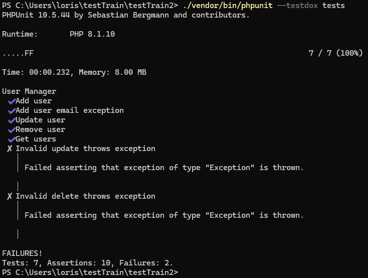
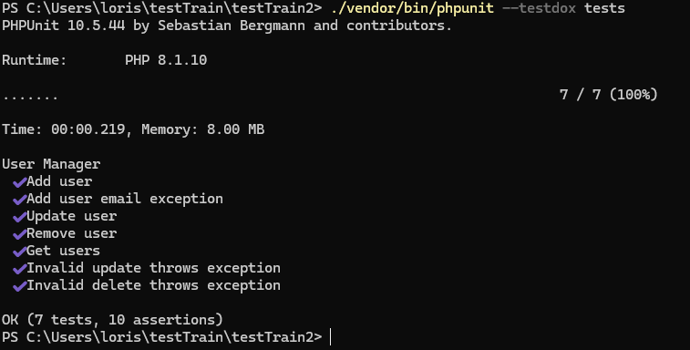
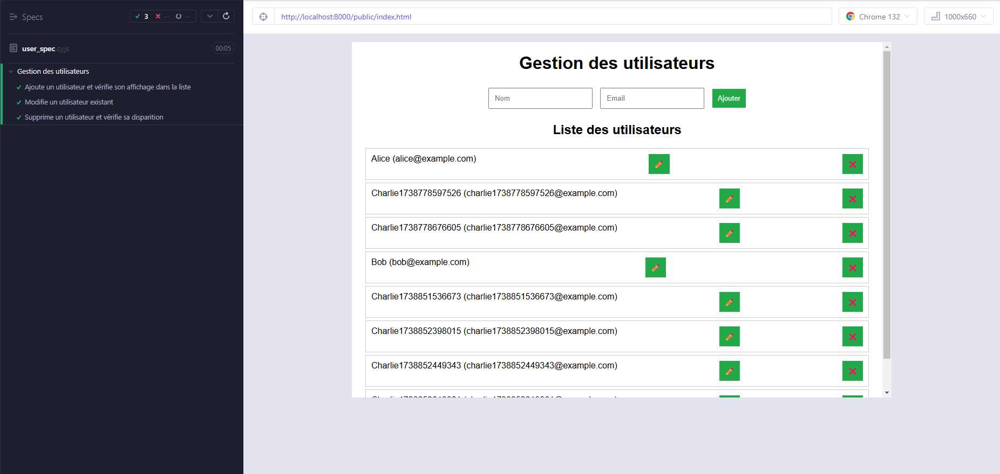
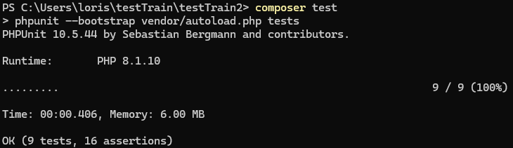
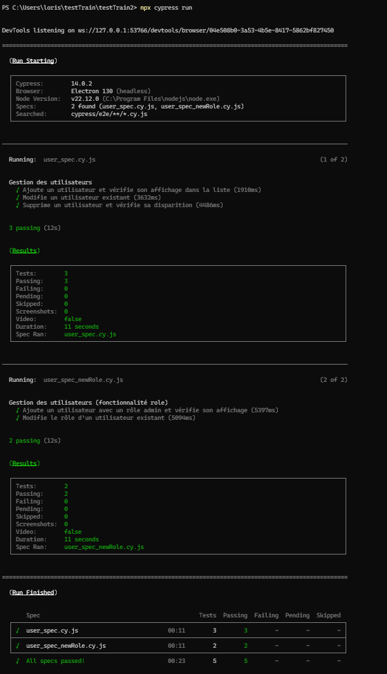
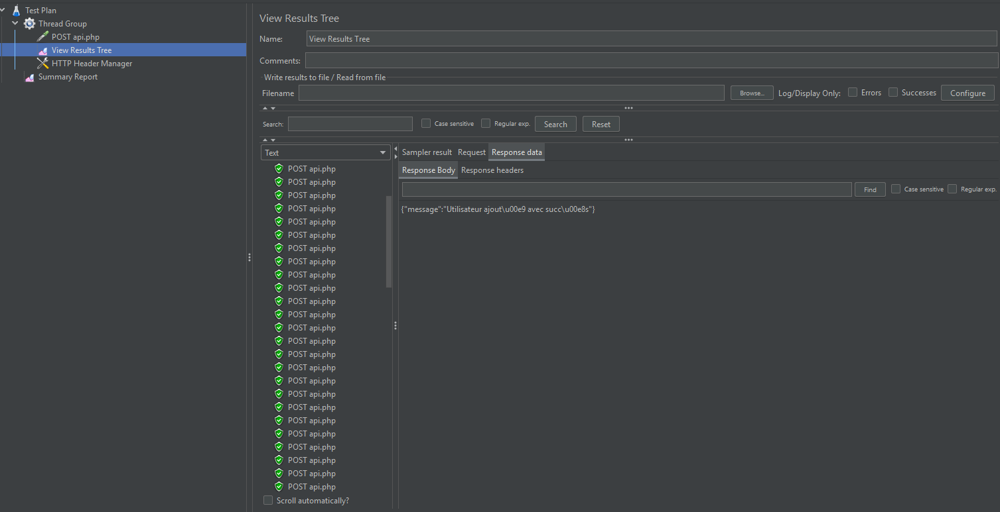
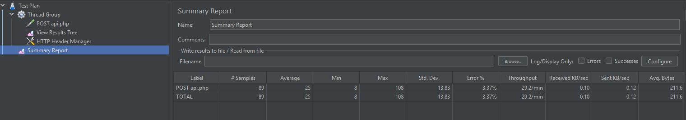

# 📌 Projet : Validation et Tests d'une Application de Gestion des Utilisateurs

Ce projet vise à tester et analyser les performances d'une **application web de gestion de tâches**, en mettant en place
des tests **unitaires**, **E2E (end-to-end)** et une **simulation de charge**.

---

## ✅ Exercice 1 : Tests Unitaires avec PHPUnit

Les fonctionnalités principales de l'application ont été testées avec PHPUnit, après éxécution des tests, je me suis
rendu compte d'un problème au niveau du code source : 
J'ai donc mit à jour les méthodes updateUset et removeUser dans le fichier UserManager.php
Après modification, voila le résultat des tests : 

---

## ✅ Exercice 2 : Tests E2E avec Cypress

Les tests **End-to-End (E2E)** ont été réalisés avec Cypress afin de **simuler le parcours d'un utilisateur** :

1. 🔹 Connexion à l'application
2. 🔹 Ajout d'une nouvelle tâche
3. 🔹 Vérification de son affichage
4. 🔹 Suppression de la tâche et vérification de sa disparition

### 🚧 Complications rencontrées

Lors du test de suppression d'une tâche, Cypress échouait à vérifier sa disparition. L'élément supprimé restait visible
dans le DOM, bien que l'API retournait un statut `200`.

### 🔧 Modifications apportées

- Ajout d'une requête `GET` après suppression pour vérifier que l'API ne retourne plus la tâche.
- Ajout d'un `cy.reload()` pour forcer l'actualisation de l'affichage.
- Utilisation de `cy.request()` pour valider directement sur l’API que l’utilisateur est effectivement supprimé dans la
  base.

📌 **Résultats des tests Cypress :**  

---

## ✅ Exercice 3 : Ajout d'une Échéance + Tests de Non-Régression

J'ai **ajouté la fonctionnalité une nouvelle colonne à la table ( rôle )*, ce qui a nécessité une modification des
tests.  
📌 **Après l'ajout de cette nouvelle fonctionnalité, j'ai relancé la suite de tests pour vérifier que les fonctionnalités
existantes ne sont pas impactées.**

📌 **Résultats des tests avec l'échéance intégrée :**  

---

## ✅ Exercice 4 : Simulation de Charge avec JMeter

J'ai simulé **plusieurs utilisateurs interagissant avec l'application simultanément** afin d'analyser les **performances
du serveur** sous forte charge.

- 🔹 **Simulation :** 50 utilisateurs effectuant des requêtes simultanées.
- 🔹 **Analyse des résultats :** Temps de réponse moyen, erreurs, débit (requests/sec).

📌 **Rapport de simulation JMeter :**  
  

---

## 🎯 Conclusion

Ce projet a permis de :

✅ **Vérifier la stabilité et la fiabilité des fonctionnalités avec PHPUnit.**  
✅ **Tester l’expérience utilisateur via des tests automatisés E2E avec Cypress.**  
✅ **Ajouter une nouvelle fonctionnalité (échéance) et valider qu’elle n’a pas cassé les fonctionnalités existantes.**  
✅ **Analyser les performances et identifier les goulots d’étranglement grâce à JMeter.**

🚀 **Les résultats montrent que l’application répond bien sous charge et que les nouvelles fonctionnalités sont bien
intégrées.**  
